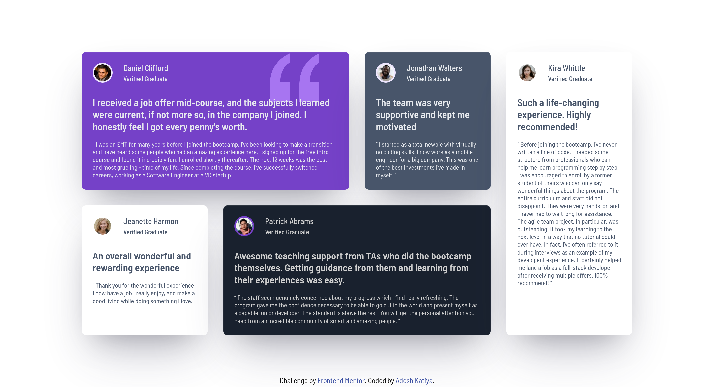

# Frontend Mentor - Testimonials grid section solution

This is a solution to the [Testimonials grid section challenge on Frontend Mentor](https://www.frontendmentor.io/challenges/testimonials-grid-section-Nnw6J7Un7). Frontend Mentor challenges help you improve your coding skills by building realistic projects.

## Table of contents

- [Overview](#overview)
  - [The challenge](#the-challenge)
  - [Screenshot](#screenshot)
  - [Links](#links)
- [My process](#my-process)
  - [Built with](#built-with)
  - [What I learned](#what-i-learned)
  - [Continued development](#continued-development)
  - [Useful resources](#useful-resources)

## Overview

### The challenge

Users should be able to:

- View the optimal layout for the site depending on their device's screen size

### Screenshot

### Links

- Solution URL: [Testimonial Grid Section](https://www.frontendmentor.io/solutions/responsive-testimonial-grid-section-using-html-scsscss-and-vite-3BPGz3_amm)
- Live Site URL: [Testimonial Grid Section](https://testimonials-grid-section-ten-nu.vercel.app/)

## My process

### Built with

- Semantic HTML5 markup
- CSS custom properties
- Flexbox
- CSS Grid
- Mobile-first workflow
- SASS
- [Vite](https://vite.dev/) - Build Tool

### What I learned

- Worked on making grid layouts easier for myself.
- Making responsive grids.

### Continued development

- Want to focus on making scalable setup for the project so that I can further polish the styles in future with minimal changes.

- Want to focus on the fluid typography (clamp() function) and container media queries for large as well as small devices.

- Want to focus on making the html more accessible for screen readers like using ARIA lables.

### Useful resources

- [CSS Tricks](https://css-tricks.com/) - Helped me with questions about grid layouts.
- [The Clamp Calculator](https://royalfig.github.io/fluid-typography-calculator/) - Helped me with fluid typography.
- [Coder Coder](https://youtu.be/QhLpMiH5Ws4?si=aq5h_G-5fhh0Sjua) - Helped me with setting up vite and responsive container styles.
